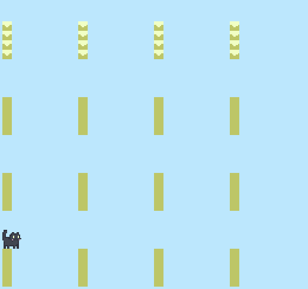

# Nekoban

Author: Anne He

Design: A simple sokoban where you play as a cat and knock objects off platforms. Modded to use 16 bit artwork.
Note that it does not currently work, but it does draw some things and has a cute cat bopping animation.

Screen Shot:

How Your Asset Pipeline Works:

Each tile or sprite is a separate 16x16png, that gets loaded into the asset pipeline. The asset pipeline loads the png and gets the image data.
Each image is processed and broken down into 8x8 tiles. Each tile is processed for its palette, and the palette is checked against existing palettes.
If it is a new palette we add it. We map the tile to the palette based on index. We process the tile layout using the palette. 

Levels are designed as 16x15 pngs, with different game elements being different color pixels. They are loaded into the pipeline and a binary matrix flags the presence of different blocks in the level.

We write all the information we have gathered into a binary file using write_chunk. This information can then be read using read_chunk in the game mode.

How To Play:

Arrow keys to move. Press "R" to reset the level. Run into blocks to push them.

Sources: Referenced several past projects for ideas on asset pipeline.
https://github.com/lassyla/game1
https://github.com/xinyis991105/15-466-f20-base1
And referenced F21 and F19 base code.

This game was built with [NEST](NEST.md).

